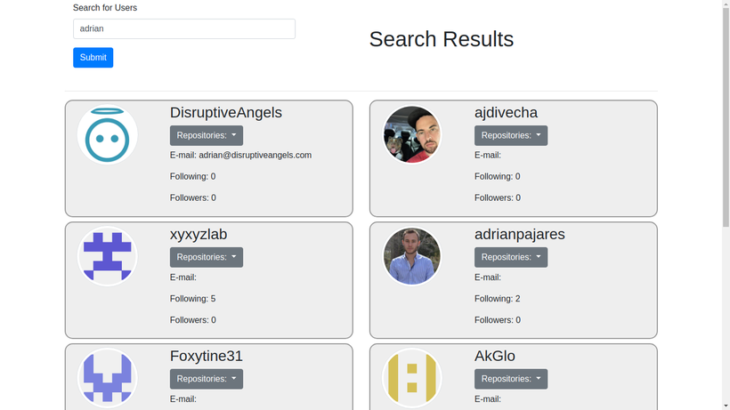
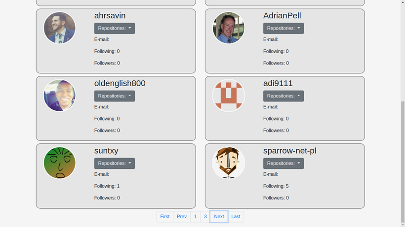
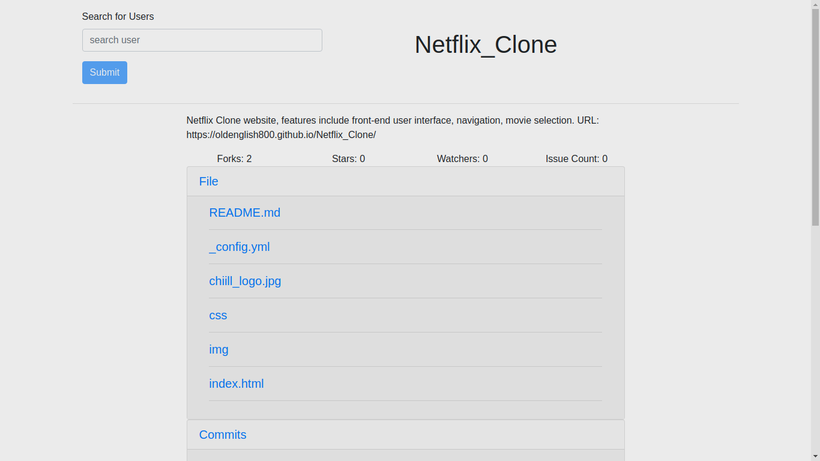

# AngularGithubClient

## How to Run
1. Open Terminal
2. Go to web app source directory
3. Write
```
npm install
```
4. To run the server write
```
ng serve
```
5. Open localhost:4200 on web browser

## Output Preview
1. Search Page

2. User Detail


3. Repo Detail


## Authors
**Verena Severina**